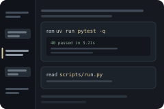

<p align="center">
  
</p>

# Introspective Chat

<p align="center">
  <a href="https://boweiliu.github.io/open-in-minds/?git_url=https://github.com/glennm292/introspective-chat"></a>
</p>

Didn't work? Create a Minds workspace and paste this to your agent:
` /use-template https://github.com/glennm292/introspective-chat`

## Why you care

A chat that shows its own work: every action says what it ran and what came back, an index tracks the conversation, and an overview counts calls, time and tokens.

When an agent works for you, most of what it did is hidden behind rows of
identical `Tool: Bash` labels you have to click open one at a time, and the only
account of what happened is the agent's own summary of itself. This chat shows
the work instead: you can read what it ran and what came back without clicking
anything, find any point in a long conversation from an index down the side, and
see at a glance where the time actually went.

## How to use it

There is nothing to launch and nothing to configure. This *is* the chat -- open
a chat tab and talk to your agent exactly as before. What changes is what the
conversation shows you.

**Read a tool call without opening it.** The header is the work, not the tool:

```
ran  uv run pytest -q
     ........................................
     40 passed in 3.21s
```

The verb is plain text, the command or path is monospace, and the first few
lines of output are already there in the collapsed block. Click to expand and
you get the whole output in a scrollable pane.

**See why, when the agent actually said why.** If a tool recorded the agent's
own stated reason for the call -- a shell command's or a delegation's
description -- it appears above the block. Nothing is ever inferred: a call with
no recorded reason gets no reason line. Instead, a batch of calls is indented
under the sentence of prose that introduced it, so the agent's own explanation
sits above the work it explains.

**Jump around a long conversation.** A rail down the left lists every message in
the conversation -- yours and the agent's, first two lines each, nothing
summarised or generated. Yours are inset and tinted, the agent's flush left.
Click one to scroll to it; the highlight follows as you scroll. The rail covers
the *whole* conversation, not just the part currently loaded, so it does not
gain and lose entries as you move.

**See where the time went.** An **Agent Overview** link sits in the footer next
to the model name. It opens a table: model calls and each kind of tool call,
with how many there were, how long they took in total and on average, biggest
consumer of time first -- plus a row of token figures. Times are gaps between
the conversation's own timestamps, so they are wall-clock rather than metered;
the panel says so, a call still awaiting its result is counted but marked
untimed rather than scored as zero, and a gap long enough to be you leaving the
room is dropped rather than charged to the model.

Both the index and the overview are ordinary read-only endpoints on the chat
server -- `/api/agents/<id>/outline` and `/api/agents/<id>/overview` -- if you
want the numbers somewhere else.

## Ideas for making it yours

- **Show more (or less) of each result.** The inline preview is capped at 4
  lines and 400 characters in `imbue/chat/harnesses/events.py`. Raise it if you
  read a lot of test output; drop it to one line if you want a denser
  transcript.
- **Write your own verbs.** Each harness has its own `tool_labels.py` deciding
  what a call's header says. Teach it your tools -- a deploy script could read
  `deployed staging` instead of `ran ./deploy.sh staging`.
- **Put the overview somewhere permanent.** `/api/agents/<id>/overview` returns
  the whole table as data. Poll it into a dashboard, or have a scheduled job
  write a weekly "where the time went" summary across all your conversations.
- **Make the index searchable.** The rail already has the opening of every
  message in the conversation. A filter box over it turns it into a find-in-
  conversation, which the windowed transcript cannot do on its own.
- **Group work differently.** `frontend/src/views/work-grouping.ts` decides
  which tool calls belong under which sentence. Collapse long runs by default,
  or fold consecutive calls to the same tool into one block.

## What this is

This repository is a published **minds template**: a clean, bootable
snapshot of what a mind built, ready to adapt into your own. It is NOT the
generic workspace template -- it is this specific project.

[`template.md`](template.md) is the full manifest -- what it is, how it
works, what it needs to run, and what to adapt -- with the
machine-readable half (recipe, requirements, and the environment it needs
installed) in [`template.toml`](template.toml).
